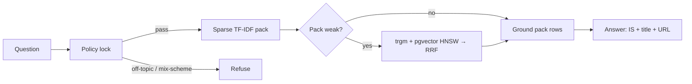

# ManakMitra

Evidence-grounded assistant for **Indian Standards** and **BIS services**.

**Smart India Hackathon 2026** · Problem statement **SIH26107** · Team **Prograckers**

ManakMitra helps MSMEs, manufacturers, consumers, students, and lab users find the right BIS pathway in English, Hindi, or Hinglish. Replies are locked to authorised catalogue metadata (IS number, title, official URL). If the pack has no match, the assistant **refuses** and hands off to an official portal.

> Not an official BIS or Government of India website. Catalogue **metadata** only — not paid clause text, not a licence-issuing authority, not a live BIS API.

**Live demo:** [forest-yonder-apex-plum.vercel.app](https://forest-yonder-apex-plum.vercel.app)

---

## What it does

- Natural-language Q&A on Indian Standards and BIS schemes
- Product → applicable IS / CRS recommendation from catalogue metadata
- Scheme separation: ISI, CRS, hallmarking / HUID, laboratory paths
- Lab name/city lookup with a live LIMS link for scope
- Official-host URLs only (`bis.gov.in`, `manakonline.in`, `crsbis.in`, `lims.bis.gov.in`, …)
- UI language lock (English / Hindi) independent of query language
- Honest refuse when evidence is missing

## Architecture

Lock-first hybrid retrieval. The policy gate runs **before** any search.



| Stage | Behaviour |
| --- | --- |
| Policy | Off-topic, clause-ask, ISI / CRS / HUID mix-up |
| Sparse | Local TF-IDF over [`src/data/rag-pack.json`](src/data/rag-pack.json) |
| Dense extras | Optional `pack_docs` (pgvector HNSW) |
| Fusion | Reciprocal Rank Fusion; extras capped |
| Ground | Pack row + allowlisted host only |
| Answer | LLM phrasing from evidence, or pack fallback if no API key |

Kill switch: `HYBRID_RAG=0` → pack-only.

## Stack

| Layer | Tech |
| --- | --- |
| App | React 19, TanStack Start, Vite, Tailwind CSS |
| Chat API | [`src/routes/api/chat.ts`](src/routes/api/chat.ts) |
| LLM | Optional xAI API (phrasing only) |
| RAG | Local pack + optional Supabase (`pg_trgm`, pgvector) |
| Embeddings | Optional Gemini 768-d (ingest only) |

## Quick start

```bash
cp .env.example .env.local
npm install
npm run dev
```

Try: **ISI mark for cement** or **Verify HUID on gold jewellery**.

## Environment

Set the same names locally and on Vercel (Production + Preview). Redeploy after adding keys.

| Variable | Required | Purpose |
| --- | --- | --- |
| `XAI_API_KEY` | Optional | Chat phrasing. Tried first. Pack fallback works without it. |
| `XAI_API_KEY_2` | Optional | Alternate xAI key if the first key fails |
| `XAI_MODEL` | Optional | Preferred xAI model (defaults try grok-4.5 then grok-3-mini) |
| `SUPABASE_URL` | Optional | Hybrid extras on `pack_docs` |
| `SUPABASE_SERVICE_ROLE_KEY` | Optional | Server-only. Never expose to the browser. |
| `HYBRID_RAG` | Optional | `0` = pack-only |
| `GEMINI_API_KEY` | Optional | Chat phrasing fallback if xAI fails; also embeddings ingest |

## Evaluation

```bash
npm run eval:all
```

No LLM required for metrics.

| Id | Gate |
| --- | --- |
| M1 | Product-family pin |
| M2 | Retrieval@3 of the pinned IS / CRS row |
| M3 | No invented IS; off-topic does not retrieve |
| M4 | Official URL present |
| M5 | Clarify-first on underspecified product |
| M6 | Scheme mix-up blocked (ISI vs CRS vs HUID) |
| M7 | Off-topic reject |
| M8 | Standalone query (no leaked IS from history) |
| M9 | Multilingual lock |
| M10 | Clause honesty (no invented clause text) |

## Pack operations

| Command | Effect |
| --- | --- |
| `npm run pack:rebuild` | Stamp verified date + validate |
| `npm run pack:add` | Ingest `data/inbox/` (official hosts only) |
| `python scripts/build_rag_index.py` | TF-IDF rebuild from authorised CSVs |

Do **not** scrape BIS, merge unknown dumps, or store paid clause text.

## Layout

```
src/routes/api/chat.ts    Chat handler
src/lib/rag.ts            Policy + sparse lock
src/lib/retrieve.ts       Hybrid extras
src/lib/intent.ts         Off-topic / social
src/data/rag-pack.json    Authorised catalogue snapshot
data/*.csv                Human-editable sources
supabase/*.sql            pack_docs + hybrid search
```

## Deploy

1. Import this repository on [Vercel](https://vercel.com).
2. Add `XAI_API_KEY` (optional) and Supabase keys (optional) for Production and Preview.
3. Deploy. After any env change, **Redeploy**.

## Operator notes

1. Full IS text lives on [Know Your Standard](https://www.bis.gov.in/know-your-standard/?lang=en) and [e-Sale](https://standardsbis.bsbedge.com/).
2. Labs are a name/city list. Confirm scope on [BIS LIMS](https://lims.bis.gov.in/).
3. Fees are FAQ figures — re-check the live page.
4. Each query is standalone.
5. The pack is a snapshot. QCO / mandatory status can change.

Official portals: [BIS](https://www.bis.gov.in) · [MANAK Online](https://www.manakonline.in) · [CRS](https://www.crsbis.in) · [LIMS](https://lims.bis.gov.in)

## License

[MIT](LICENSE) © 2026 Team Prograckers

See [CONTRIBUTING](CONTRIBUTING.md) and [SECURITY](SECURITY.md).
