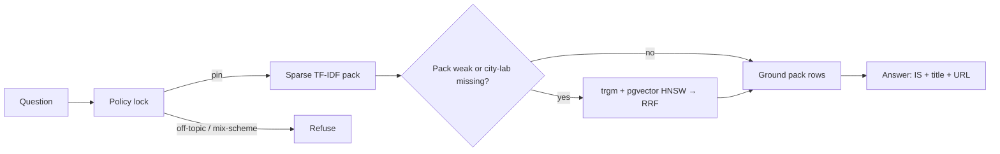

# ManakMitra

**Evidence-first assistant for Indian Standards and BIS services.**

Smart India Hackathon 2026 · Problem statement **26107** · Team **Prograckers**

ManakMitra answers questions about Indian Standards, ISI / CRS / FMCS, hallmarking, testing labs, and consumer processes in **plain language**. Every reply is locked to an authorised catalogue (IS number + title + official URL). If the pack has no match, it **refuses** instead of inventing a number.

> Not an official BIS or Government of India website. Catalogue **metadata** only — not paid clause text, not a live BIS API, not a tender engine (SIH 26108).

[Features](#features) · [Architecture](#architecture) · [Quick start](#quick-start) · [Environment](#environment) · [Evaluation](#evaluation) · [Deploy](#deploy)

---

## Features

- Natural-language Q&A on Indian Standards and BIS schemes
- Product → applicable IS / CRS recommendation from catalogue metadata
- Hallmarking (HUID / CARE) vs jeweller licence paths kept separate
- Lab **name/city** lookup with a live LIMS link for scope
- Official-host URLs only (`bis.gov.in`, `manakonline.in`, `crsbis.in`, …)
- Hindi / English UI language lock (reply language = header, not the query)
- Honest refuse when evidence is missing

## Architecture

Lock-first hybrid retrieval. Policy gate runs **before** any vector search.



| Stage | What it does |
| --- | --- |
| Policy | Off-topic, clause-ask, ISI/CRS/HUID mix-up |
| Sparse | Local TF-IDF over [`src/data/rag-pack.json`](src/data/rag-pack.json) |
| Dense extras | `pack_docs` 768-d pgvector when that kind is filled |
| Fusion | `search_pack_docs_hybrid` (trgm + dense RRF), extras capped |
| Ground | Pack row + allowlisted host only |
| Answer | LLM phrasing from evidence, or pack fallback if `XAI_API_KEY` is unset |

Kill switch: `HYBRID_RAG=0` → pack-only.

## Stack

| Layer | Tech |
| --- | --- |
| App | React 19, TanStack Start, Vite, Tailwind CSS |
| Chat API | [`src/routes/api/chat.ts`](src/routes/api/chat.ts) |
| LLM | xAI (`XAI_API_KEY` / `XAI_API_KEY_2`, optional) |
| RAG | Local pack + optional Supabase (`pg_trgm`, pgvector HNSW) |
| Embeddings | Gemini 768-d (optional, ingest only) |

## Quick start

```bash
cp .env.example .env.local   # add XAI_API_KEY (or XAI_API_KEY_2)
npm install
npm run dev
```

Open the app, ask e.g. **ISI mark for cement** or **Verify HUID on gold jewellery**.

## Environment

Set the **same names** locally and on Vercel (Production + Preview). Redeploy after adding keys.

| Variable | Required | Used for |
| --- | --- | --- |
| `XAI_API_KEY` or `XAI_API_KEY_2` | Chat phrasing | Runtime prefers `XAI_API_KEY_2`, then `XAI_API_KEY`. Pack fallback works without either. |
| `XAI_MODEL` | Optional | Defaults to `grok-4.5` |
| `SUPABASE_URL` | Hybrid extras | `pack_docs` search |
| `SUPABASE_SERVICE_ROLE_KEY` | Hybrid extras | Server-only. Never `NEXT_PUBLIC_*`. |
| `HYBRID_RAG` | Optional | `0` = pack-only |
| `GEMINI_API_KEY` | Optional | Embeddings for ingest — **not** chat |

Unused auto-injected names (`NEXT_PUBLIC_SUPABASE_*`, `POSTGRES_*`) are ignored.

## Evaluation

```bash
npm run eval:all
```

No LLM required for metrics.

| Id | Gate |
| --- | --- |
| M1 | Product-family pin |
| M2 | Retrieval@3 of the pinned IS / CRS row (≥95%) |
| M3 | No invented IS; off-topic does not retrieve |
| M4 | Official URL 100% |
| M5 | Clarify-first on underspecified product |
| M6 | Scheme mix-up 0 (ISI vs CRS vs HUID) |
| M7 | Off-topic reject |
| M8 | Standalone query (no leaked IS from history) |
| M9 | Multilingual lock |
| M10 | Clause honesty (Know Your Standard / e-Sale, no invented clause text) |

## Pack operations

| Command | Effect |
| --- | --- |
| `npm run pack:rebuild` | Stamp verified date + validate |
| `npm run pack:add` | Ingest `data/inbox/` (official hosts only) |
| `python scripts/build_rag_index.py` | Full TF-IDF rebuild from authorised CSVs |

Do **not** scrape BIS, merge unknown JSON dumps, or store paid clause text.

## Project layout

```
src/routes/api/chat.ts    Chat handler
src/lib/rag.ts            Policy + sparse lock
src/lib/retrieve.ts       Hybrid extras
src/lib/intent.ts         Off-topic / social
src/data/rag-pack.json    Authorised catalogue snapshot
data/*.csv                Human-editable sources
supabase/*.sql            pack_docs + hybrid search
```

## Deploy

1. Import this repo on [Vercel](https://vercel.com).
2. Add `XAI_API_KEY` (or `XAI_API_KEY_2`) and optional Supabase keys for **Production** and **Preview**.
3. Deploy. After any env change, **Redeploy**.

No separate FastAPI host.

## Operator notes

1. Full IS text lives on [Know Your Standard](https://standards.bis.gov.in/website/know-your-standards) and [e-Sale](https://standardsbis.bsbedge.com/).
2. Labs are a name/city list. Confirm scope on [BIS LIMS](https://lims.bis.gov.in/home/search_is_number/).
3. Fees are BIS FAQ figures — re-check the live FAQ.
4. Each query is standalone. Cue words (`fees` / `lab`) do not reuse an earlier product.
5. Pack is a snapshot. QCO / mandatory status can change.

Official portals: [BIS](https://www.bis.gov.in) · [MANAK Online](https://www.manakonline.in) · [CRS](https://www.crsbis.in/BIS/about-crs.do) · [LIMS](https://lims.bis.gov.in/home/search_is_number/)

## License

[MIT](LICENSE) © 2026 Team Prograckers

See [CONTRIBUTING](CONTRIBUTING.md) and [SECURITY](SECURITY.md).
