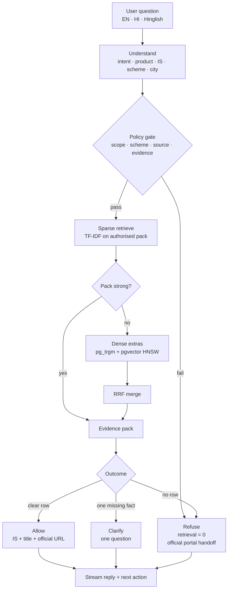

# ManakMitra

**Evidence-grounded assistant for Indian Standards and BIS services.**

[](https://www.sih.gov.in)
[](#team)
[](https://forest-yonder-apex-plum.vercel.app/)
[](LICENSE)

> Lock-first → retrieve-second → ground → **Allow / Clarify / Refuse**.  
> Public catalogue **metadata** only. No paid clause text. No invented fees.

**Smart India Hackathon 2026** · Problem statement **SIH26107**  
Ministry of Consumer Affairs, Food & Public Distribution · Theme: Smart Automation · Team ID **175176**

| Live MVP | Demo | Repo | Architecture |
| --- | --- | --- | --- |
| [Vercel](https://forest-yonder-apex-plum.vercel.app/) · [Grok preview](https://forest-yonder-apex-plum.grok.me) | [YouTube](https://www.youtube.com/watch?v=oi7lZYGw1Uw) | [github.com/owais265/ManakMitra](https://github.com/owais265/ManakMitra) | [gitdiagram](https://gitdiagram.com/owais265/manakmitra) |

This is **not** an official website of BIS or the Government of India. Always re-check the live portal before you apply, pay, or file.

**Contents:** [Problem](#1-problem--who-pays-for-the-wrong-door) · [Innovation](#2-innovation--why-a-chatbot-was-not-enough) · [Complexity](#3-technical-complexity--what-is-actually-hard) · [Feasibility](#4-feasibility--it-already-runs) · [Architecture](#5-architecture--system-design) · [Implementation](#6-implementation-quality) · [UX](#7-user-experience) · [Impact](#8-impact) · [Scale](#9-scalability--deployment) · [Start](#quick-start) · [Docker](#docker) · [Team](#team-prograckers)

---

## How this maps to evaluation

Judges score understanding, novelty, depth, feasibility, design, a working build, UX, impact and scale. This README answers those questions with the live product — not a claim sheet.

| Criterion | What to inspect here | Live proof |
| --- | --- | --- |
| Problem understanding | [1](#1-problem--who-pays-for-the-wrong-door) | Wrong-door examples in the [demo video](https://www.youtube.com/watch?v=oi7lZYGw1Uw) |
| Innovation | [2](#2-innovation--why-a-chatbot-was-not-enough) | Fan + HUID **refuse** (retrieval = 0) |
| Technical complexity | [3](#3-technical-complexity--what-is-actually-hard) | Four locks before search; RRF only after unlock |
| Feasibility | [4](#4-feasibility--it-already-runs) | [Live MVP](https://forest-yonder-apex-plum.vercel.app/) |
| Architecture | [5](#5-architecture--system-design) | [gitdiagram](https://gitdiagram.com/owais265/manakmitra) |
| Implementation | [6](#6-implementation-quality) | Desks + `npm run eval:all` |
| UX / UI | [7](#7-user-experience) | First-run path under 30 seconds |
| Impact | [8](#8-impact) | Official BIS scale, not invented MAU |
| Scalability | [9](#9-scalability--deployment) | Pack-only → hybrid extras → Vercel |

---

## 1. Problem — who pays for the wrong door

**Why does this problem exist?**  
BIS already publishes standards and runs certification, hallmarking, laboratory recognition, Standards Clubs, training and consumer affairs. The record is public. The path is not. A manufacturer, jeweller, student or consumer still has to guess which portal, which scheme and which document applies.

**Who faces it?**

| User | What they need | What goes wrong today |
| --- | --- | --- |
| MSME / startup | Applicable IS + scheme before they apply | Consultant fees, or days on the wrong form |
| Manufacturer / importer | ISI vs CRS vs FMCS vs QCO | One product family, several legal doors |
| Jeweller / consumer | Hallmark / HUID check | HUID language applied to fans, helmets, appliances |
| QC / lab user | Recognised lab + LIMS scope | Directory hunting; no PIN-to-lab path |
| Student / Standards Club | Plain-language IS identity | Catalogue and paid text mixed together |
| BIS / DoCA helpdesk | First-level routing | Repeat “which portal?” calls |

**How serious is it?**  
Official published scale of the BIS space (not ManakMitra usage):

| Published stock | Order of magnitude | Source class |
| --- | --- | --- |
| Indian Standards in force | ~23,300 | BIS public reporting cited on the idea PPT |
| Operative licences | ~51,500 | Same |
| New licences in a recent year | ~9,700 | Same |

Searching many portals and PDFs is exactly the pain SIH26107 names. The gap is not “there is no chatbot”. The gap is **routing with evidence**, so a user does not lose days at the wrong BIS door.

---

## 2. Innovation — why a chatbot was not enough

Generic RAG on mixed PDFs looks complete and still sends a fan query to jewellery verification. ManakMitra treats **refusal as a feature**.

What is unique (not a bundle of existing tools):

1. **Lock-first, retrieve-second.** Search is illegal until scope, scheme, source and evidence unlock.
2. **Scheme router.** ISI, CRS, FMCS, QCO and HUID stay separate. A mismatch does not retrieve.
3. **Three exits.** Allow (sourced row) · Clarify (one missing fact) · Refuse (portal handoff, retrieval = 0).
4. **Hybrid retrieve only after unlock.** Sparse TF-IDF on the pack, then optional `pg_trgm` + pgvector HNSW, then RRF.
5. **Model-down continuity.** If the LLM is offline, the pack still returns IS number, scheme path and official URL.
6. **Public metadata only.** No paid clause text, no invented fees, no fake confidence score.

**Why this was not already solved:** BIS.gov.in is a library of portals, not a gate. A generic assistant can quote a paragraph and still pick the wrong scheme. The hard product is the gate.

---

## 3. Technical complexity — what is actually hard

Complexity is used where the problem needs it.

| Hard part | Why it is not a wrapper |
| --- | --- |
| Policy gate before any index call | Off-topic, clause-ask, and scheme mix-up must die in milliseconds |
| Scheme-conflict detection | “Fan pe HUID” must not become a jewellery flow |
| Sparse + dense + RRF on one authorised pack | Rank fusion only on allowlisted rows |
| Ground-then-generate | The model may phrase a pack row. It may not invent an IS number |
| Standalone turns | Chat history must not leak yesterday’s IS into today’s product |
| Language lock | Header language (EN / HI / Hinglish) beats query-script guessing |
| Eval harness M1–M10 | Gates are tested without an LLM |

Not used: a billion-vector demo index, synthetic “official” PDFs, or a 22-language claim the pack cannot ground.

---

## 4. Feasibility — it already runs

The MVP is public. A judge can open it without installing anything.

| Proof | Where |
| --- | --- |
| Working app | https://forest-yonder-apex-plum.vercel.app/ |
| Demo walkthrough | https://www.youtube.com/watch?v=oi7lZYGw1Uw |
| Pack-only laptop path | `docker compose up --build` → http://localhost:8080 |
| Eval without an LLM | `npm run eval:all` |

Roadmap after the MVP (from the idea PPT, not vapour):

1. Scheme-conflict graph
2. Evidence freshness leases
3. Adversarial safety harness
4. Officer escalation packets
5. Gap scanner as a pathway constraint engine

Mature pieces: Postgres FTS + pgvector, serverless Node, optional LLM phrasing. The pack path does not depend on a model vendor.

---

## 5. Architecture and system design

Search is not allowed until the gate unlocks.


```mermaid
flowchart TD
  Q[User question<br/>EN · HI · Hinglish] --> U[Understand<br/>intent · product · IS · scheme · city]
  U --> G{Policy gate<br/>scope · scheme · source · evidence}
  G -->|fail| X[Refuse<br/>retrieval = 0<br/>official portal handoff]
  G -->|pass| S[Sparse retrieve<br/>TF-IDF on authorised pack]
  S --> W{Pack strong?}
  W -->|yes| E[Evidence pack]
  W -->|no| H[Dense extras<br/>pg_trgm + pgvector HNSW]
  H --> F[RRF merge]
  F --> E
  E --> O{Outcome}
  O -->|clear row| A[Allow<br/>IS + title + official URL]
  O -->|one missing fact| C[Clarify<br/>one question]
  O -->|no row| X
  A --> R[Stream reply + next action]
  C --> R
  X --> R
```

| Layer | Choice | Why this, not a larger stack |
| --- | --- | --- |
| App | React 19, TanStack Start, Vite, Tailwind | One TypeScript surface for UI + `/api/chat` |
| Gate + sparse RAG | [`src/lib/rag.ts`](src/lib/rag.ts), [`src/data/rag-pack.json`](src/data/rag-pack.json) | Answers without a vendor |
| Hybrid extras | Supabase: `pg_trgm` + pgvector HNSW + RRF | Optional. Kill switch `HYBRID_RAG=0` |
| Phrasing LLM | Optional xAI, Gemini fallback | Phrases pack rows. Never the source of an IS number |
| Hosting | Vercel + Supabase | Live MVP for evaluation |

| Lock | Blocks |
| --- | --- |
| Scope | Sports, movies, trivia |
| Scheme | HUID on a fan, CRS language on jewellery |
| Source | Non-allowlisted hosts |
| Evidence | No pack row → no generated “fact” |

---

## 6. Implementation quality

Built desks, not a slide-only assistant.

| Desk | User job |
| --- | --- |
| Assistant | Natural-language Q&A with three exits |
| Verify product | Licence-shaped check against the verify pack |
| Testing labs | PIN / city → nearest list + live LIMS |
| HUID / Hallmark finder | Jewellery path only |
| Indian Standards finder | Product / IS → catalogue row |
| Certification steps | Scheme process + official portal |
| File a complaint | CARE / CMED handoff |

Measured latency (prototype, idea PPT):

| Path | Measured / target | Notes |
| --- | --- | --- |
| Off-topic refuse | ~0.1–0.2 s | Gate only. Retrieval not called |
| In-scope pack answer | ~1.0–1.8 s | Gate + retrieve + pack |
| LLM phrasing | ~3–6 s | Only when a key works |
| Policy gate | < 50 ms | Four locks |
| Sparse / dense / RRF | < 200 / 300 / 100 ms | After unlock |

Safety eval (`npm run eval:all`, no LLM required):

| Id | Gate |
| --- | --- |
| M1 | Product-family pin |
| M2 | Retrieval@3 of the pinned IS / CRS row |
| M3 | No invented IS; off-topic does not retrieve |
| M4 | Official URL present |
| M5 | Clarify-first on an underspecified product |
| M6 | Scheme mix-up blocked |
| M7 | Off-topic reject |
| M8 | Standalone query (no leaked IS) |
| M9 | Multilingual lock |
| M10 | Clause honesty |

---

## 7. User experience

A first-time user should not need a manual.

- One header language lock (English · Hindi · Hinglish) across every desk
- Suggested prompts on the landing page, same queries the assistant accepts
- Status the user can read: sourced answer, one clarifying question, or official handoff
- Official URL on an Allow — not a screenshot of a PDF
- Contact / complaint scrolls to the real handoff, it does not invent a ticket
- Light and dark theme; mobile, tablet and laptop

**Jury path (under two minutes):**

1. Pack hit — `Which Indian Standard applies to PET bottles for drinking water?`
2. Clarify — `Helmet ke liye BIS kaise milega?`
3. Safe refuse — `Fan pe HUID kaise check karun?`
4. Verify — a `CM/L` shape the verify desk accepts
5. Lab — PIN or city; map + LIMS
6. HUID — jewellery only

---

## 8. Impact

ManakMitra does not claim to serve every licence in India. It shortens the first-level path for people who already have to use BIS.

| Who | Measurable change if the gate holds |
| --- | --- |
| MSMEs and startups | Fewer wrong-scheme applications before Manakonline / CRS |
| Manufacturers and importers | ISI / CRS / FMCS named before they pay a consultant |
| Consumers and jewellers | HUID stays on jewellery; fake-mark complaint goes to CARE |
| QC and labs | Name / city / PIN → LIMS, not a guessed rating |
| Students and Clubs | IS identity in plain language, with the official record |
| BIS / DoCA helpdesks | Repeat “which portal?” questions drop to a handoff card |

Published BIS stock (~23.3K standards, ~51.5K operative licences) is the **addressable official space**, cited from BIS / PIB material on the idea PPT. It is not a user-count for this app.

---

## 9. Scalability and deployment

| Stage | What runs | What you add |
| --- | --- | --- |
| Judge laptop | Pack-only Docker / `npm run dev` | Nothing |
| Live MVP | Vercel + pack + optional LLM phrasing | `XAI_API_KEY` |
| Hybrid | Same app + Supabase `pack_docs` | `SUPABASE_*`, `HYBRID_RAG=1` |
| Production later | Same Postgres, freshness leases, conflict graph | Pack ops, not a rewrite |

Horizontal scale is boring on purpose: the gate is CPU-cheap, the pack is a snapshot, dense extras are an index on official rows. Cost stays low because refuse and pack-hit do not need a model. Idea-PPT operating sketch: a few thousand rupees a month at pilot query volume; model tokens only on Allow phrasing.

Kill switch: `HYBRID_RAG=0` → pack-only, still correct.

---

## What it does vs will not do

| Problem-statement job | What ManakMitra does | What it will not do |
| --- | --- | --- |
| Answer questions on Indian Standards | Match product / IS to catalogue title + official record | Invent an IS number or quote paid clause text |
| Recommend a standard from a product | Pack row + Know Your Standard link | Guess when the pack is silent |
| Guide certification schemes | Router: ISI · CRS · FMCS · QCO | Mix HUID into a fan / helmet query |
| Explain the process | Steps + portal when the FAQ pack has them | Invent fees or statutory timelines |
| Consumer queries | Complaints, fake mark, CARE / CMED | Act as a legal opinion |
| Hallmarking / HUID | Format + official verify path | Treat HUID as a product licence |
| Recognised laboratories | PIN / city + live LIMS | Book a test or invent a rating |
| Multilingual | EN · HI · Hinglish, header lock | Claim 22 languages it cannot ground |

---

## Quick start

```bash
git clone https://github.com/owais265/ManakMitra.git
cd ManakMitra
cp .env.example .env.local
npm install
npm run dev
```

Open [http://localhost:8080](http://localhost:8080). Pack-only mode works with an empty `.env.local`.

```bash
npm run typecheck
npm test
npm run eval:all
```

---

## Docker

```bash
cp .env.example .env.local   # optional keys
docker compose up --build
```

App: [http://localhost:8080](http://localhost:8080)

| File | Role |
| --- | --- |
| [`Dockerfile`](Dockerfile) | Multi-stage Node 22 build + preview |
| [`docker-compose.yml`](docker-compose.yml) | Single service, port 8080 |
| [`.dockerignore`](.dockerignore) | Keeps the image small |

---

## Environment

Same names locally, in Docker, and on Vercel (Production + Preview). Redeploy after changing keys.

| Variable | Required | Purpose |
| --- | --- | --- |
| `XAI_API_KEY` | No | Chat phrasing. Tried first |
| `XAI_API_KEY_2` | No | Alternate xAI key |
| `XAI_MODEL` | No | Override model id |
| `GEMINI_API_KEY` | No | Phrasing fallback + ingest embeddings |
| `SUPABASE_URL` | No | Hybrid extras on `pack_docs` |
| `SUPABASE_SERVICE_ROLE_KEY` | No | Server only. Never ship to the browser |
| `HYBRID_RAG` | No | `0` = pack-only kill switch |

---

## Pack operations

| Command | Effect |
| --- | --- |
| `npm run pack:rebuild` | Stamp verified date + validate |
| `npm run pack:add` | Ingest `data/inbox/` — official hosts only |
| `python scripts/build_rag_index.py` | TF-IDF rebuild from authorised CSVs |

Do **not** scrape BIS, merge unknown dumps, or store paid clause text. Full document text lives on [Know Your Standard](https://www.bis.gov.in/know-your-standard/?lang=en) and [e-Sale](https://standardsbis.bsbedge.com/).

```
src/routes/api/chat.ts     Chat handler
src/lib/rag.ts             Policy + sparse lock
src/lib/retrieve.ts        Hybrid extras
src/lib/intent.ts          Off-topic / social
src/data/rag-pack.json     Authorised catalogue snapshot
data/*.csv                 Human-editable sources
supabase/*.sql             pack_docs + hybrid search
scripts/eval-*.mjs         Golden + metrics
```

Operator rules: labs are a name/city list — confirm scope on [LIMS](https://lims.bis.gov.in/). Fees in the pack are FAQ figures. Each turn is standalone. QCO / mandatory status can change on the official site.

Official hosts: [bis.gov.in](https://www.bis.gov.in) · [manakonline.in](https://www.manakonline.in) · [crsbis.in](https://www.crsbis.in) · [lims.bis.gov.in](https://lims.bis.gov.in)

---

## Team Prograckers

| Name | Role |
| --- | --- |
| Navneet Kumar Singh | Leadership, resource allocation, presenter |
| Prapti Verma | PPT, UI/UX |
| Mohammed Owais | Data, backend, RAG architecture, servers |
| Rohit Kumar | Research, retrieval mathematics |
| Gurdev Singh | Research, GitHub, live deployment |
| Aman Dwivedi | Presenter, coordination, idea |

---

## License

[MIT](LICENSE) © 2026 Team Prograckers

See [CONTRIBUTING](CONTRIBUTING.md) and [SECURITY](SECURITY.md).
