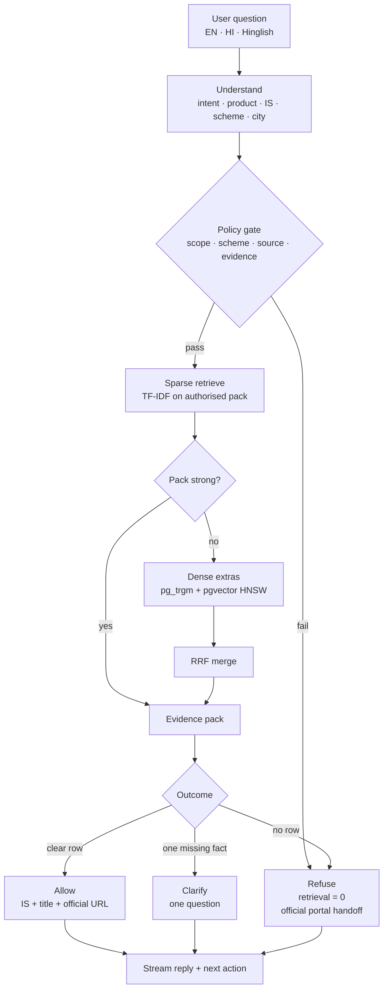

# ManakMitra

**Evidence-grounded assistant for Indian Standards and BIS services.**

[](https://www.sih.gov.in)
[](#team)
[](https://forest-yonder-apex-plum.vercel.app/)
[](LICENSE)

> Lock-first → retrieve-second → ground → **Allow / Clarify / Refuse**.  
> Public catalogue **metadata** only. No paid clause text. No invented fees.

**Smart India Hackathon 2026** · Problem statement **SIH26107**  
Ministry of Consumer Affairs, Food & Public Distribution · Theme: Smart Automation · Team ID **175176**

| Live MVP | Demo | Repo | Architecture |
| --- | --- | --- | --- |
| [Vercel](https://forest-yonder-apex-plum.vercel.app/) · [Grok preview](https://forest-yonder-apex-plum.grok.me) | [YouTube](https://www.youtube.com/watch?v=oi7lZYGw1Uw) | [github.com/owais265/ManakMitra](https://github.com/owais265/ManakMitra) | [gitdiagram](https://gitdiagram.com/owais265/manakmitra) |

This is **not** an official website of BIS or the Government of India. Always re-check the live portal before you apply, pay, or file.

---

## Why this exists

BIS publishes thousands of Indian Standards and runs certification, hallmarking, laboratory recognition, training and consumer services. MSMEs, startups, students and consumers still lose days jumping across PDFs and portals to answer:

- Which Indian Standard applies to this product?
- Which scheme — ISI (Scheme-I), CRS (Scheme-II), FMCS, QCO, hallmarking?
- Where is the recognised lab? How do I check a HUID?
- Where do I file a complaint for a fake Standard Mark?

ManakMitra is the conversational layer on the **public record**. It does not replace BIS or a consultant. It stops a user from walking into the wrong BIS door.

---

## What it does

Mapped 1:1 to SIH26107 expected capabilities.

| Problem-statement job | What ManakMitra does | What it will not do |
| --- | --- | --- |
| Answer questions on Indian Standards | Match product / IS number to catalogue title, group, official record | Invent an IS number or quote paid clause text |
| Recommend a standard from a product description | Pack row + official “Know Your Standard” link | Guess a number when the pack is silent |
| Guide certification schemes | Scheme router: ISI · CRS · FMCS · QCO | Mix jewellery HUID into a fan / helmet query |
| Explain the process | Steps + portal (Manakonline, crsbis.in) when the FAQ pack has them | Invent fees or statutory timelines |
| Consumer queries | Complaints, fake mark, CARE / CMED handoff | Act as a legal opinion |
| Hallmarking / HUID | HUID format + official verify path | Treat HUID as a product-licence check |
| Recognised laboratories | Name / city / PIN → nearest list + live LIMS | Book a test or invent a lab rating |
| Multilingual | English · Hindi · Hinglish, header language lock | Claim 22 languages it cannot ground |

Desks on the live site: **Assistant · Verify product · Testing labs · HUID · Hallmark finder · Indian Standards finder · Certification steps · File a complaint**.

---

## How an answer is made

Search is not allowed until the gate unlocks.


```mermaid
flowchart TD
  Q[User question<br/>EN · HI · Hinglish] --> U[Understand<br/>intent · product · IS · scheme · city]
  U --> G{Policy gate<br/>scope · scheme · source · evidence}
  G -->|fail| X[Refuse<br/>retrieval = 0<br/>official portal handoff]
  G -->|pass| S[Sparse retrieve<br/>TF-IDF on authorised pack]
  S --> W{Pack strong?}
  W -->|yes| E[Evidence pack]
  W -->|no| H[Dense extras<br/>pg_trgm + pgvector HNSW]
  H --> F[RRF merge]
  F --> E
  E --> O{Outcome}
  O -->|clear row| A[Allow<br/>IS + title + official URL]
  O -->|one missing fact| C[Clarify<br/>one question]
  O -->|no row| X
  A --> R[Stream reply + next action]
  C --> R
  X --> R
```

| Lock | Blocks |
| --- | --- |
| Scope | Sports, movies, trivia, general chat |
| Scheme | HUID on a fan, CRS language on jewellery, ISI/CRS mix-up |
| Source | Non-allowlisted hosts |
| Evidence | No pack row → no generated “fact” |

If the model is down, the **pack still returns** the IS number, scheme path and official link. That is a product requirement, not a fallback apology.

---

## Measured latency (prototype)

From the official idea PPT. Pack path does not wait on the model.

| Path | Measured / target | Notes |
| --- | --- | --- |
| Off-topic refuse | ~0.1–0.2 s | Gate only. Retrieval not called |
| In-scope pack answer | ~1.0–1.8 s | Gate + hybrid retrieve + pack |
| Greeting / social | ~1.5–2.0 s | Template path |
| LLM phrasing | ~3–6 s | Pack + model rewrite when the key works |
| Policy gate | < 50 ms | Four locks |
| Sparse (`pg_trgm` / TF-IDF) | < 200 ms | Exact / fuzzy text |
| Dense (pgvector HNSW) | < 300 ms | Meaning match |
| RRF merge + pack build | < 100 ms | Rank fusion |

---

## Jury demo queries

Run these in order. They are the product, not a script overlay.

1. **Pack hit** — `Which Indian Standard applies to PET bottles for drinking water?`  
   Expect a sourced IS row only if the pack has it.
2. **Clarify** — `Helmet ke liye BIS kaise milega?`  
   One question: which type of helmet.
3. **Safe refuse** — `Fan pe HUID kaise check karun?`  
   Scheme mismatch. Retrieval calls = 0. Product-certification handoff. Not jewellery verify.
4. **Verify** — a `CM/L` licence shape the verify desk accepts.
5. **Lab** — a PIN / city search. Map + LIMS, no invented rating.
6. **HUID** — jewellery only.

---

## Stack

| Layer | Choice | Why |
| --- | --- | --- |
| App | React 19, TanStack Start, Vite, Tailwind CSS | One TypeScript surface for UI + `/api/chat` |
| Gate + sparse RAG | [`src/lib/rag.ts`](src/lib/rag.ts), [`src/data/rag-pack.json`](src/data/rag-pack.json) | Pack answers without a vendor |
| Hybrid extras | Supabase Postgres: `pg_trgm` + pgvector HNSW + RRF | Optional. Kill switch `HYBRID_RAG=0` |
| Phrasing LLM | Optional xAI, Gemini fallback | Phrases pack rows. Never a source of IS numbers |
| Embeddings | Optional Gemini 768-d | Ingest only |
| Hosting | Vercel + Supabase | Live MVP for evaluation |

---

## Quick start

```bash
git clone https://github.com/owais265/ManakMitra.git
cd ManakMitra
cp .env.example .env.local
npm install
npm run dev
```

Open [http://localhost:8080](http://localhost:8080). Pack-only mode works with an empty `.env.local`.

```bash
npm run typecheck
npm test
npm run eval:all
```

`eval:all` does not need an LLM.

---

## Docker

One command. Pack-only by default so a judge laptop does not need Supabase or an API key.

```bash
cp .env.example .env.local   # optional keys
docker compose up --build
```

App: [http://localhost:8080](http://localhost:8080)

| File | Role |
| --- | --- |
| [`Dockerfile`](Dockerfile) | Multi-stage Node 22 build + preview |
| [`docker-compose.yml`](docker-compose.yml) | Single service, port 8080 |
| [`.dockerignore`](.dockerignore) | Keeps the image small |

Pass keys at runtime if you want phrasing or hybrid extras:

```bash
docker compose up --build -d
# or
docker run --env-file .env.local -p 8080:8080 manakmitra
```

---

## Environment

Same names locally, in Docker, and on Vercel (Production + Preview). Redeploy after changing keys.

| Variable | Required | Purpose |
| --- | --- | --- |
| `XAI_API_KEY` | No | Chat phrasing. Tried first |
| `XAI_API_KEY_2` | No | Alternate xAI key |
| `XAI_MODEL` | No | Override model id |
| `GEMINI_API_KEY` | No | Phrasing fallback + ingest embeddings |
| `SUPABASE_URL` | No | Hybrid extras on `pack_docs` |
| `SUPABASE_SERVICE_ROLE_KEY` | No | Server only. Never ship to the browser |
| `HYBRID_RAG` | No | `0` = pack-only kill switch |

---

## Evaluation harness

| Id | Gate |
| --- | --- |
| M1 | Product-family pin |
| M2 | Retrieval@3 of the pinned IS / CRS row |
| M3 | No invented IS; off-topic does not retrieve |
| M4 | Official URL present |
| M5 | Clarify-first on an underspecified product |
| M6 | Scheme mix-up blocked (ISI vs CRS vs HUID) |
| M7 | Off-topic reject |
| M8 | Standalone query (no leaked IS from history) |
| M9 | Multilingual lock |
| M10 | Clause honesty (no invented clause text) |

```bash
npm run eval:golden
npm run eval:rewrite
npm run eval:pack
npm run eval:metrics
```

---

## Pack operations

| Command | Effect |
| --- | --- |
| `npm run pack:rebuild` | Stamp verified date + validate |
| `npm run pack:add` | Ingest `data/inbox/` — official hosts only |
| `python scripts/build_rag_index.py` | TF-IDF rebuild from authorised CSVs |

Do **not** scrape BIS, merge unknown dumps, or store paid clause text. Full document text lives on [Know Your Standard](https://www.bis.gov.in/know-your-standard/?lang=en) and [e-Sale](https://standardsbis.bsbedge.com/).

---

## Layout

```
src/routes/api/chat.ts     Chat handler
src/lib/rag.ts             Policy + sparse lock
src/lib/retrieve.ts        Hybrid extras
src/lib/intent.ts          Off-topic / social
src/data/rag-pack.json     Authorised catalogue snapshot
data/*.csv                 Human-editable sources
supabase/*.sql             pack_docs + hybrid search
scripts/eval-*.mjs         Golden + metrics
Dockerfile                 Container build
docker-compose.yml         One-command run
```

---

## Deploy

1. Import this repository on [Vercel](https://vercel.com).
2. Set optional `XAI_API_KEY` and Supabase keys for Production and Preview.
3. Deploy. After any env change, **Redeploy**.

Operator rules:

1. Labs are a name / city list. Confirm scope on [BIS LIMS](https://lims.bis.gov.in/).
2. Fees in the pack are FAQ figures. Re-check the live page.
3. Each chat turn is standalone. History must not leak an IS number into a new product.
4. The pack is a snapshot. QCO / mandatory status can change on the official site.

Official hosts: [bis.gov.in](https://www.bis.gov.in) · [manakonline.in](https://www.manakonline.in) · [crsbis.in](https://www.crsbis.in) · [lims.bis.gov.in](https://lims.bis.gov.in)

---

## Team Prograckers

| Name | Role |
| --- | --- |
| Navneet Kumar Singh | Leadership, resource allocation, presenter |
| Prapti Verma | PPT, UI/UX |
| Mohammed Owais | Data, backend, RAG architecture, servers |
| Rohit Kumar | Research, retrieval mathematics |
| Gurdev Singh | Research, GitHub, live deployment |
| Aman Dwivedi | Presenter, coordination, idea |

---

## License

[MIT](LICENSE) © 2026 Team Prograckers

See [CONTRIBUTING](CONTRIBUTING.md) and [SECURITY](SECURITY.md).
